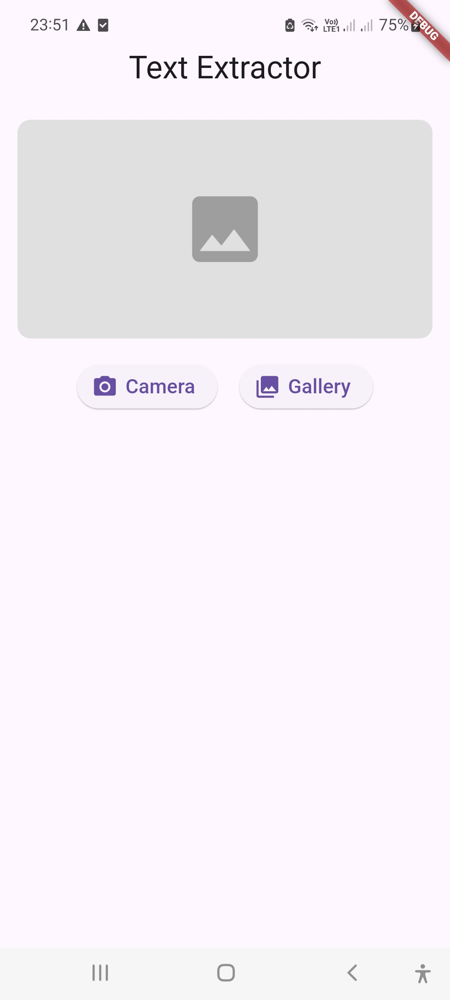
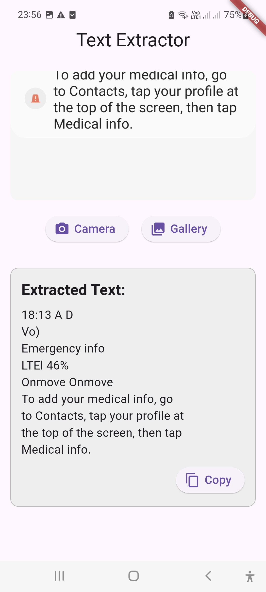

# Text Recognition App (OCR) with Flutter

A Flutter application that extracts text from images using **Google ML Kit's Text Recognition API**. The app allows users to capture or select an image and extract the text, making it useful for document scanning, note-taking, and automation tasks.

## 📸 Features
- Capture an image using the **camera** 📷
- Select an image from the **gallery** 🖼️
- Extract text using **Google ML Kit** 🧠
- Copy extracted text with a single tap 📋
- Handles **permissions** dynamically 🚀

## 🛠️ Technologies Used
- **Flutter** (Dart)
- **Google ML Kit (Text Recognition API)**
- **Image Picker** (for selecting/capturing images)
- **Permission Handler** (for managing permissions)

## 📂 Project Structure
```
/ lib
  ├── main.dart                 # Entry point of the application
  ├── text_recognition_page.dart # UI and logic for text recognition
/android                        # Native Android setup
/ios                            # Native iOS setup
```

## 🚀 Installation
### Prerequisites
- Flutter SDK installed ([Download here](https://flutter.dev/docs/get-started/install))
- Dart installed
- Android Studio or VS Code with Flutter extension

### Steps
1. **Clone the repository**
   ```sh
   git clone https://github.com/YourGitHubUsername/TextRecognitionApp.git
   cd TextRecognitionApp
   ```
2. **Install dependencies**
   ```sh
   flutter pub get
   ```
3. **Run the app**
   ```sh
   flutter run
   ```

## 📜 Dependencies
Ensure you have the following dependencies in your `pubspec.yaml`:
```yaml
dependencies:
  flutter:
    sdk: flutter
  image_picker: ^1.0.4
  google_ml_kit: ^0.19.0
  permission_handler: ^11.3.0
```

## 🔐 Permissions

The app requires the following permissions:

### Android
Add these to `AndroidManifest.xml`:
```xml
<uses-permission android:name="android.permission.CAMERA" />
<uses-permission android:name="android.permission.READ_EXTERNAL_STORAGE" />
```

### iOS
Add these to `Info.plist`:
```xml
<key>NSCameraUsageDescription</key>
<string>We need access to your camera to scan images.</string>
<key>NSPhotoLibraryUsageDescription</key>
<string>We need access to your gallery to select images.</string>
```

## ⚠️ Note on Arabic Language Support
By default, Google ML Kit's text recognition performs well with English text but has **limited support** for Arabic and some other languages. To improve Arabic OCR:
- Consider using **Tesseract OCR** (Open Source)
- Use **cloud-based OCR solutions** for better accuracy

## 👨‍💻 Author
- **Ahmed Zidan**
- LinkedIn: [Your LinkedIn](https://www.linkedin.com/in/ahmed-zidan-aa373a289/)
- GitHub: [Your GitHub](https://github.com/Ahmed811)

## 🌟 Contributing
Feel free to **fork**, improve, and submit a PR! Contributions are always welcome. 😊

## 📜 License
This project is **open-source** under the MIT License. Feel free to use and modify it as needed.

---
## 📸 Screenshots

### Home Screen


### Extracted Text


---
Happy Coding! 🚀
